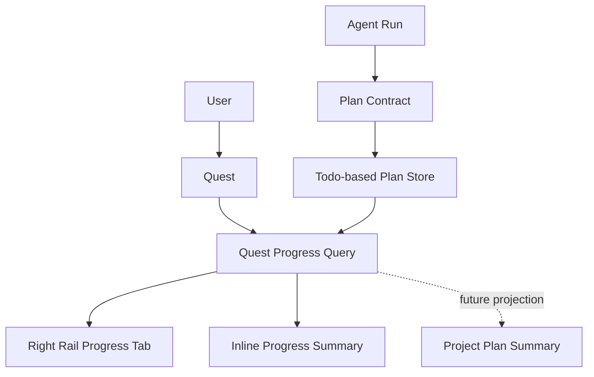

# Design Document

## Overview

本设计把 `Progress` 正式提升为一个可独立演进的产品能力：`Pluse Plan`。

`Pluse Plan` 不是新的底层存储对象，也不是先做成一个项目级大看板；它首先是 **Quest 级别的 Plan Mode**，用于把 Agent 的计划、执行、等待人类介入、历史完成项，以一个从上到下的顺序流持续展示给用户。

本期的核心目标不是“再造一个 Todo 面板”，而是建立一个稳定的人机协作执行层：

- 用户发出目标后，Agent 先生成计划，再执行
- 计划以顺序流形式持续保留在当前 Quest 中
- doing / waiting / done 都属于同一条主计划流
- 人类条目与 Agent 条目暂时共用一套底层结构
- 右侧栏 `Progress` 成为主要阅读入口
- 项目级聚合若后续存在，只能由 Quest 级 Plan 派生

本期非目标：

- 不新建 `progress_items` 表
- 不把项目级 Progress 面板继续作为主定义
- 不做拖拽换序
- 不做复杂树状多层结构
- 不把 `waiting` 拆成单独存储状态或单独对象
- 不在本期把 `Pluse Plan` 拆成独立服务

## Architecture



### 核心架构判断

1. `Pluse Plan` 是产品能力，不是独立数据库主对象。
2. `Quest Plan` 是唯一主定义；项目级汇总只能是派生视图。
3. 底层继续复用现有 `Todo`，避免双系统并存。
4. Agent 在写入新步骤前必须读取当前 Quest 的已有计划。
5. `waiting` 是计划条目的一个可见语义，不是另一条列表。
6. 前端主入口放在右侧栏，而不是继续把 Progress 主要塞在聊天区里。

### 设计取舍

#### 方案 A：继续沿用旧的 Project Progress Panel 路线
- 优点：项目全局看板概念直观
- 缺点：会把 Quest 级执行计划和项目级汇总混在一起
- 缺点：旧方案大量假设独立 `progress_items` 模型或项目级主界面
- 结论：不采用，改为废弃旧口径

#### 方案 B：定义 `Pluse Plan`，以 Quest Plan 为主、项目级汇总为派生
- 优点：更符合 Agent 实际执行边界
- 优点：与现有 `originQuestId`、`progress-create/update/wait`、Quest UI 连续
- 优点：可先在现有系统里稳定落地，再考虑是否抽为独立子项目或独立模块
- 结论：本期采用

### 旧文档处置策略

以下文档建立在“项目级 Progress 面板是主定义”或“独立 `progress_items` 模型”之上，与当前 `Pluse Plan` 设计冲突，应在本设计确认后统一标记为 `obsolete` 或归档参考：

- `docs/v2/requirements/0014-project-progress-panel.md`
- `docs/v2/designs/0014-project-progress-panel.md`
- `docs/v2/specs/0014-project-progress-panel-mvp.md`
- `docs/v2/specs/0014-project-progress-panel-phase-1.md`

处置原则：
- 在新设计未确认前，不立即物理删除
- 新设计确认后，优先“作废/归档”而非直接移除，保留迁移脉络
- 代码与实现以后续 `Pluse Plan` 口径为准，不再回到旧 0014 路线

## Components and Interfaces

### 1. Plan Kernel

职责：为 `Pluse Plan` 提供统一语义层。

责任范围：
- 定义什么是 `Plan_Item`
- 维护顺序、状态与可见性规则
- 约束 Agent 的读写方式
- 为不同 UI 表面提供统一投影

本期不新增单独持久化对象，Kernel 先以 `Todo` 语义映射实现。

### 2. Quest Progress Query

职责：按 `questId` 聚合当前 Quest 的所有未归档计划条目，生成主计划流。

接口原则：
- 继续复用 `GET /api/quests/:id/progress`
- 查询边界保持 `originQuestId = questId`
- 返回结果按顺序流排序，而非按状态分组
- 不引入新的项目级主查询接口作为真源

### 3. Right Rail Progress Tab

职责：作为 `Pluse Plan` 的主阅读入口。

放置规则：
- 位置在右侧栏
- 属于右栏顶层 Tab 之一
- 推荐顺序：`Progress / 待办 / 提醒 / 打卡`
- 只有当前存在 `activeQuestId` 时，`Progress` 才可用
- 若用户当前不在 Quest 详情页，可隐藏或置灰 `Progress`

展示规则：
- 单列顺序流
- 不按 AI / Human / Waiting 分区
- 每个条目只显示轻量状态符号、主文案、次级说明
- `doing` 显示 `activeForm ?? title`
- `waiting` 继续停留在主序列中，只追加说明文案
- `done` 保留但视觉弱化
- 不支持拖拽换序

建议结构：

```text
[Progress]

● 正在梳理摄影学习路径
✓ 了解摄影基础概念
○ 选择入门拍摄设备
○ 练习构图与曝光
○ 设计第一周练习计划
```

### 4. Inline Progress Summary

职责：在聊天区或任务详情中提供折叠态摘要。

规则：
- 只作为辅助入口，不再承担主阅读职责
- 展开后与右栏读取同一套 Quest Plan 数据
- 继续保留“用户可以顺手看一眼当前进度”的能力
- 不再按 AI / Human / Waiting 拆段

### 5. Agent Plan Contract

职责：约束 Agent 如何使用 `Pluse Plan`。

必须规则：
- 开始执行前读取当前 Quest 的已有计划
- 复杂任务优先一次性列出多个步骤
- 执行时更新已有条目，而不是重复新建
- 需要人类确认、补信息或决策时，创建 `waiting` 语义条目
- 等待结束后继续沿用原计划，而不是重开一套新计划

本期继续复用现有命令语义：
- `progress-create`
- `progress-update`
- `progress-wait`

### 6. Future Project Plan Summary

职责：未来在项目维度提供派生总览，而不是替代 Quest Plan。

本期结论：
- 项目级面板不是主定义
- 未来如需“这个项目现在整体做到哪”，应从多个 Quest Plan 聚合生成
- 聚合结果适合做摘要，不适合反向驱动 Quest 级计划写入

## Data Models

本期不新增表，继续使用现有 `Todo` 作为 `Plan_Item` 的底层结构。

### 现有字段与 Plan 语义映射

| Todo 字段 | Plan 语义 |
|---|---|
| `projectId` | 条目所在项目 |
| `originQuestId` | 条目归属的 Quest，也是主查询边界 |
| `title` | 静态步骤名称 |
| `activeForm` | doing 状态的进行中文案 |
| `waitingInstructions` | 条目当前需要的人类介入说明 |
| `status` | 计划推进状态 |
| `order` | 顺序位置 |
| `createdAt` | 进入计划流的初始时间 |
| `updatedAt` | 最近一次推进时间 |
| `createdBy` | 创建来源（human / ai / system） |

### Plan Row 投影

前端展示时，建议从底层 `Todo` 投影出统一的 UI 行模型：

```ts
interface PlanRow {
  id: string
  questId: string
  createdBy: 'human' | 'ai' | 'system'
  state: 'pending' | 'doing' | 'waiting' | 'done' | 'cancelled'
  displayText: string
  helperText?: string
  order: number
  createdAt: string
  updatedAt: string
}
```

派生规则：
- 若 `status === 'doing'`，`displayText = activeForm ?? title`
- 若 `waitingInstructions` 存在且条目未完成，`state = 'waiting'`
- 其他情况下，`displayText = title`

### 顺序规则

Quest 级 `PlanRow` 列表按以下规则排序：

1. `order ASC`
2. `createdAt ASC`
3. `id ASC` 作为稳定兜底

该规则表达“计划先后顺序”，不是优先级系统，也不是状态看板排序。

### 人类 Todo 的本期边界

本期允许人类条目与 Agent 条目先共用同一底层结构与同一主计划流。

约束：
- 人类条目进入 Quest Plan 的前提是绑定当前 `originQuestId`
- 不因 `createdBy=human` 而切出独立主列表
- 未来若出现“人类支线”或“辅助轨道”，也必须建立在同一底层数据结构之上

## Correctness Properties

*A property is a characteristic or behavior that should hold true across all valid executions of a system-essentially, a formal statement about what the system should do. Properties serve as the bridge between human-readable specifications and machine-verifiable correctness guarantees.*

### Property Selection Reasoning

- `Quest Plan` 聚合完整性适合做属性测试，因为它对任意 Quest 条目集合都应成立。
- 顺序流排序适合做属性测试，因为它必须对任意输入集合稳定成立。
- doing / waiting 的显示映射适合做单元测试与属性测试组合。
- 历史完成项保留规则适合做属性测试，因为它反映的是状态变化后的可见性不变量。
- Agent 续写计划而不重复造新条目适合做集成测试与属性测试组合。

### Property 1: Quest plan contains all non-deleted quest items

*For any* quest and any set of non-deleted `Todo` items whose `originQuestId` equals that quest id, the `Pluse Plan` Quest view should contain exactly those items and should exclude items belonging to other quests.

**Validates: Requirements 1.1, 1.2, 1.3**

### Property 2: Plan order follows explicit sequence

*For any* set of `Plan_Item` records in the same quest, sorting the Quest Plan view should produce an order consistent with ascending `order`, then ascending `createdAt`, with equal keys preserving deterministic ordering.

**Validates: Requirements 2.1, 2.2, 2.3**

### Property 3: Doing and waiting states render the correct presentation

*For any* `Plan_Item`, when the item status is `doing`, the Plan view should render `activeForm` if present and otherwise render `title`; when the item is unfinished and contains `waitingInstructions`, the Plan view should preserve the item in the main sequence and expose waiting guidance rather than moving it into a separate list.

**Validates: Requirements 3.2, 3.3, 4.4**

### Property 4: Done items remain in sequence until archive or delete

*For any* `Plan_Item` that transitions from `pending` or `doing` to `done`, the Quest Plan view should continue to include the item in the same ordered stream until an archive or delete action changes visibility.

**Validates: Requirements 2.4, 3.4, 5.3**

### Property 5: Agent updates preserve plan continuity

*For any* sequence of agent progress operations on the same quest, updating an existing `Plan_Item` to `doing` or `done` should preserve the same logical item identity rather than creating a duplicate completed item for the same finished step.

**Validates: Requirements 4.1, 4.2, 4.3**

### Property 6: Human and agent items share one rendering model

*For any* quest-bound item created by a human user or by an agent run, the Quest Plan view should be able to project the item through the same `Plan_Item` rendering model while preserving source-specific metadata.

**Validates: Requirements 5.1, 5.2, 5.4**

## Error Handling

### 数据错误
- 若 Quest 不存在，Quest Plan 视图返回空错误态，而不是误展示其他 Quest 的条目。
- 若条目缺失 `originQuestId`，该条目不得进入任何 Quest Plan 主查询结果。
- 若 doing 条目缺失 `activeForm`，前端回退显示 `title`。
- 若条目存在 `waitingInstructions` 但正文为空，前端回退显示 `title` 并保留等待说明。

### Agent 写入异常
- 若 Agent 创建计划条目失败，不应伪造前端成功状态。
- 若 Agent 更新条目失败，后续刷新必须以服务端真实状态为准。
- 若 Agent 在执行前读取 Plan 失败，可显示空态，但不得误把其他 Quest 条目并入当前计划。
- 若 `progress-wait` 超时，原等待条目应继续可见，供用户理解当前卡点。

### UI 异常
- 若右栏当前没有 `activeQuestId`，`Progress` Tab 不应展示错误的历史 Quest 数据。
- 若 Progress 拉取失败，应展示轻量错误提示和重试入口。
- 若列表为空，应展示“当前会话尚无计划项”的空状态，而不是展示 Todo 默认空态。
- 若 inline summary 与右栏同时存在，两者应使用同一数据源，避免显示不一致。

## Testing Strategy

### 单元测试

重点验证：
- Quest 级排序函数
- `PlanRow` 投影规则（`doing` / `waiting` / `done`）
- `displayText` 选择逻辑（`activeForm` vs `title`）
- 右栏 `Progress` Tab 的启用/禁用条件
- 空态、错误态、等待态的展示映射

### 属性测试

建议继续使用 TypeScript 生态中的 `fast-check`。

每个属性测试至少运行 100 次，并在测试注释中标记：
- `Feature: unified-project-plan-model, Property 1: Quest plan contains all non-deleted quest items`
- `Feature: unified-project-plan-model, Property 2: Plan order follows explicit sequence`
- 依此类推

### 集成测试

重点验证：
- `GET /api/quests/:id/progress` 返回的结果满足顺序流规则
- Agent 使用 `progress-create/update/wait` 后，Quest Plan 数据能正确更新
- 右栏切到 `Progress` 时，读取的是当前 `activeQuestId` 对应数据
- waiting 条目不会被拆出主序列
- done 条目不会因为完成而从计划流中消失
- human / ai 条目可以在同一条 Quest Plan 中共同显示

### 单元测试与属性测试的分工
- 单元测试：状态映射、空值回退、Tab 启用规则、行模型展示
- 属性测试：聚合完整性、稳定排序、历史保留、waiting 可见性
- 集成测试：Quest 查询接口、前端右栏表现、Agent 写入链路、一致性刷新
