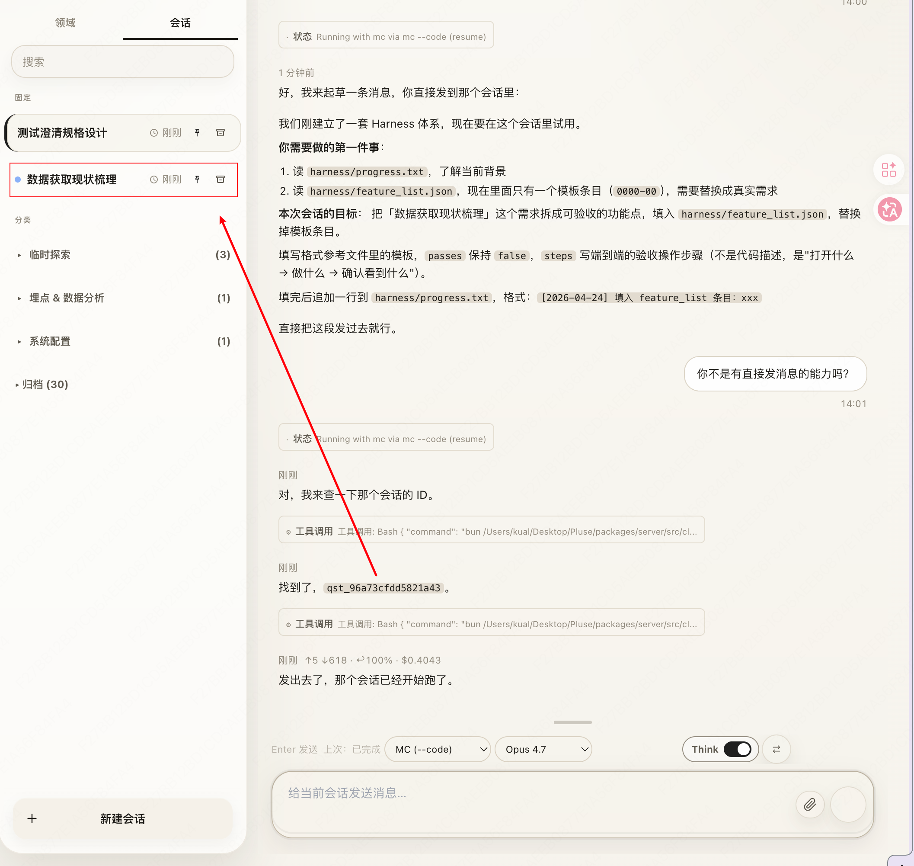
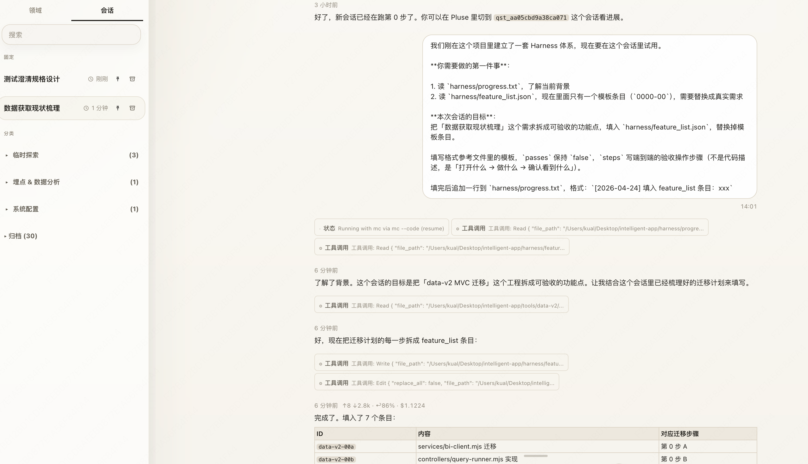
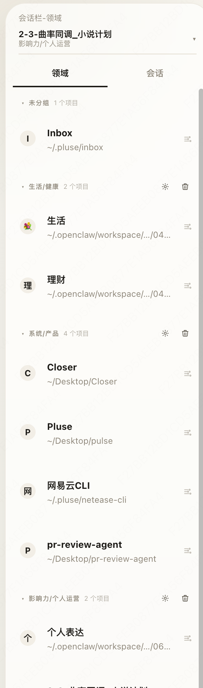

# 一次AI+人类共生体的生活方式探索

### 产品哲学

做抛开Agent和记忆的工具层。
你可以：
- 接入自己的Agent
- 获得一个舒服的Agent交流体验
- 另类的多Agent协作，不再限制于Agent架构

### 全部操作皆cli化
消息cli：
```
quest message
```

case 1:开会话让它给你发过去自己聊

讨论出结果直接让它继续发信息





case 2：claude调用codex聊天
在开启会话时让它用codex来聊天就能做到claude使用codex进行聊天


### 可拓展性


领域下面有n个产品，这样可以给未来各种cli一个比较好的嵌入位置。
此外如果你在完成需求时，比如说让Agent决定你每天听什么歌，我就做了一个基于网易云cli+AI的cli，就能比较丝滑的把这个cli系统嵌入到项目中。

当你聊完需求的时候，产品就诞生了。

### 宏大的思路

我想要把人类的各种内容都基于这个平台进行维护从抽象角度。

文件系统=人类工作的过程内容
会话=人类与AI的交互
任务=人类与AI的交互

这些加起来就是一个AI产品的最小雏形，理论上所有的AI产品都可以被拆成这样的结构。

由此All in one，把自己的数据统一记录，我相信未来会有神奇的事会发生。

这里文件系统我的方案时使用obsidian

## 问题
上手门槛还是一个比较严重的问题，这点不否认，安装对于没有技术的朋友来说还是有一定门槛的。但会技术的朋友应该可以很快的上手。

## 未来，
其实这样你可以看见很多的玩法：
1. 产品自迭代。
2. 待办Agent推荐。

这是我对于未来的思考，也可以看我的小说（马上开始连载）